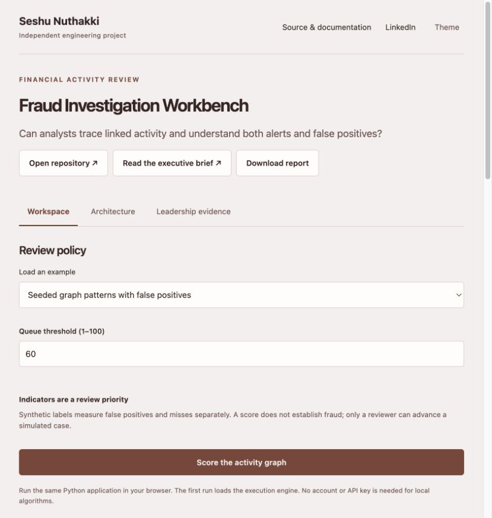
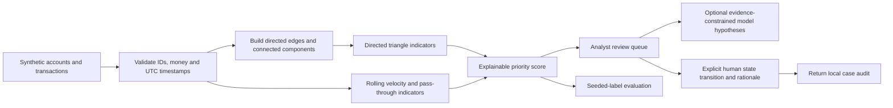

# Fraud Investigation Workbench

[](https://github.com/Snuthakki21/fraud-investigation-workbench/actions/workflows/ci.yml) [](https://github.com/Snuthakki21/fraud-investigation-workbench/actions/workflows/pages.yml)

**[Open the application](https://Snuthakki21.github.io/fraud-investigation-workbench/)** · [Independent Staff Engineer review](projects/fraud_investigation_workbench/independent-staff-review.md) · [Shared runtime review](docs/INDEPENDENT_RUNTIME_REVIEW.md) · [Verification evidence](docs/VALIDATION.md) · [Tests](tests) · [Run locally](docs/RUNNING.md)



Examples: [Default input](examples/base.json) · [Higher threshold tradeoff](examples/scenario-2.json) · [Unlabeled analyst workflow](examples/scenario-3.json) · [Executed default report](examples/report.json)

**An analyst can inspect connected transactions, explain a review priority, see known false positives, and record an accountable case review. Every account and label is synthetic.**

This application flags activity for human investigation. It does not accuse people, block accounts, file reports or determine that a crime occurred.

## Executive brief

A detection alert becomes useful when an investigator can understand the evidence and the operational tradeoff. This reference application combines transaction graphs, rolling transfer velocity and pass-through indicators with an explicit case-review workflow.

The seeded example deliberately includes legitimate treasury cycles that resemble the seeded ring pattern and a large single transfer the heuristic misses. At the default threshold, the code computes **7 review candidates, 4 true positives, 3 false positives and 1 false negative** against the synthetic labels. Precision is **57.14%** and recall is **80%**. These are measured fixture outcomes, not estimated performance on real financial crime.

Raising the review threshold from 60 to 75 prioritizes only the synthetic hub: precision rises to 100% while recall falls to 20% on this tiny fixture. The example exposes the workload/coverage tradeoff instead of presenting an unqualified accuracy number.

| Leadership lens | Observable evidence |
| --- | --- |
| Principal | Directed graph algorithms, temporal windows, monetary precision, label-leakage controls, revision checks and model evidence validation |
| Director | Analyst workload, false-positive costs, missed-case review, responsible adoption and accountable case transitions |

The business hypothesis is more focused investigations with traceable reasoning. A real pilot should measure analyst time, alert disposition, overlooked cases and false-positive workload using appropriately governed data. This repository claims no production reduction in losses or review cost.

## Run it

With Python 3.11 or later, from the repository root:

```sh
python -m portfolio run fraud_investigation_workbench
python -m unittest discover -s tests -p 'test_fraud_investigation_workbench.py' -v
```

The standalone browser application executes the same Python logic and exposes scenarios for the original seeded graph, a higher threshold, and unlabeled data. The latter reports no precision or recall because it has no ground truth.

```python
from projects.fraud_investigation_workbench.project import default_input, run

payload = default_input()
result = run(payload)
assert result["details"]["evaluation"]["false_positives"] == 3
payload["review_threshold"] = 75
assert set(run(payload)["details"]["case_states"]) == {"HUB"}
```

All original data is in [synthetic_activity.json](projects/fraud_investigation_workbench/fixtures/synthetic_activity.json). Entity IDs are invented identifiers, and no protected traits are accepted by the input schema.

## Supported functionality

- Validate known transaction endpoints, unique record IDs, amounts with at most two decimal places, and timestamps with explicit UTC offsets.
- Aggregate directed transaction edges and compute undirected connected components for context.
- Identify directed three-account cycles and count outgoing transfers in rolling 60-minute windows.
- Identify possible pass-through patterns when at least three senders fund an account and its outbound value within one day of its first receipt is 80–120% of total inbound value.
- Produce inspectable, weighted review priorities and the transactions or cycle IDs behind each indicator.
- Compute precision, recall and the confusion matrix from optional complete synthetic entity labels. Detection never reads those labels.
- Apply explicit human case-state events with matching source state, current activity revision, reviewer, rationale and entity-specific evidence references.
- Optionally call a real model for evidence-citing investigation hypotheses. Model output cannot change priority scores or case states.

## Architecture



Amounts are converted to integer cents before aggregation. Connected components give context; suspicion is not automatically propagated to connected neighbors. Scores are rule weights, not probabilities. Entity `kind` is descriptive and does not alter scoring.

## Input and output contract

`default_input()` loads the original fixture. `run(payload, context=None)` accepts:

| Field | Meaning |
| --- | --- |
| `entities` | 2–200 objects with only `id` and `kind` (`account`, `merchant`, `treasury`) |
| `transactions` | 1–1,000 objects with `id`, `from`, `to`, `amount`, `timestamp` |
| `review_threshold` | Integer 1–100; default 60 |
| `ground_truth` | Optional complete map of entity IDs to boolean seeded labels |
| `case_reviews` | At most 300 explicit human review events |

The result includes a plain-English `summary`, computed `metrics`, `evidence`, `next_actions` and inspectable `details`. Details include every entity's indicators, aggregated edges, components, cycles, evaluation, revision, case states, review audit and model-use disclosure.

Malformed values, unknown identities, duplicate IDs, naive timestamps, unsupported fields, invalid transitions, stale revisions and unsupported model evidence raise `ValueError`. No partial case update is persisted. With no positive labels, recall is undefined; with no candidates, precision is undefined. Undefined metrics are omitted rather than displayed as invented zeroes.

## Human case review

Cases begin in `new`. Allowed transitions are `new → triaged`, `triaged → investigating / closed_no_issue`, and `investigating → escalated / closed_no_issue`. There is no automated fraud-confirmed disposition. `escalated` and `closed_no_issue` are terminal in the supported demonstration.

Each review event requires `review_id`, `entity_id`, `from_state`, `to_state`, `reviewer`, `rationale`, `evidence_ids` and `expected_revision`. The revision binds transactions, entities and threshold. Changing the evidence invalidates a previous review event. The audit is returned to the caller; it is not durable case-management storage or authenticated human identity.

## Model role

Local mode uses graph and temporal heuristics and needs no API key. The optional shared provider receives computed review candidates and case states. It returns entity-specific hypotheses with cited evidence IDs. The project independently validates those IDs and keeps model-authored prose separate from computed findings. Valid IDs do not prove a narrative interpretation; analysts must review any hypothesis.

The model has no account-action tool, no SQL interpreter and no authority to accuse an entity or close a case. Provider errors fail the run without creating an action.

## Architecture decisions

**ADR-01 — Transparent rules before trained scoring.** Synthetic labels support a test fixture but are insufficient to train or validate a real detector. Inspectable weights and counterexamples make the current decision process reviewable. Add supervised or graph models only after representative, governed labels and temporal validation exist.

**ADR-02 — Bound graph scope.** Directed triangles are useful illustrative patterns with an explicit ceiling. Arbitrary cycle enumeration can become expensive and can overwhelm analysts; add longer-path analysis only with a concrete investigation need.

**ADR-03 — Keep disposition human.** The system computes review priority. Account actions and final case dispositions require a separate authenticated and auditable operational process.

## Evaluation and review

The local suite has 22 test methods plus multiple invalid-input subcases. It covers seeded confusion counts, threshold tradeoffs, label isolation, unlabeled behavior, undefined metrics, broken graph edges, rolling windows, outbound-before-inbound timing, valid and invalid case transitions, stale revisions, evidence mismatch, model failures and protected-trait rejection.

All statements and branches in this project were exercised with Coverage.py 7.16.1 in the local verification run. Coverage measures executed paths; it does not establish production fitness, general model accuracy or complete adversarial protection.

The author review is recorded in [engineering-review.md](projects/fraud_investigation_workbench/engineering-review.md). Independent automated review is recorded separately by a reviewer who did not author this project.

## Limits and production roadmap

- The graph indicators are hypotheses. Legitimate cash management, business payments and treasury transfers can exhibit the same shapes.
- The pass-through comparison uses aggregate values; it does not establish that the same funds moved onward. The first-receipt one-day window is a deliberate bounded approximation.
- The fixture has 17 accounts and 37 transactions. Real precision/recall requires representative prevalence, independently adjudicated labels, temporal holdouts and feedback-lag handling.
- There is no learned model, identity verification, production case database, external filing or account-blocking integration.
- Production design needs identity/entity resolution, privacy controls, authorized investigation roles, review audit retention, drift monitoring and institution-specific policy/legal review.

Contextual primary references: [FinCEN risk-based banking guidance](https://www.fincen.gov/resources/statutes-regulations/guidance/interagency-interpretive-guidance-providing-banking) and the [Federal Reserve Payment System Risk guide](https://www.federalreserve.gov/paymentsystems/2011_psr_guide.htm). These references provide background; this demonstration does not implement or certify regulatory compliance.
